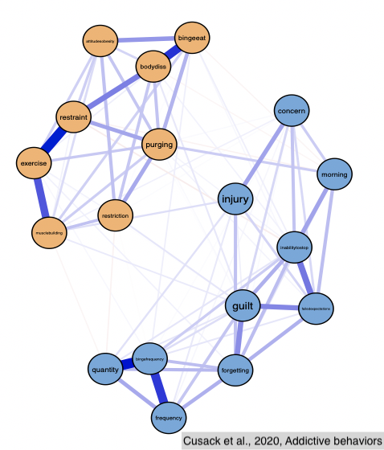
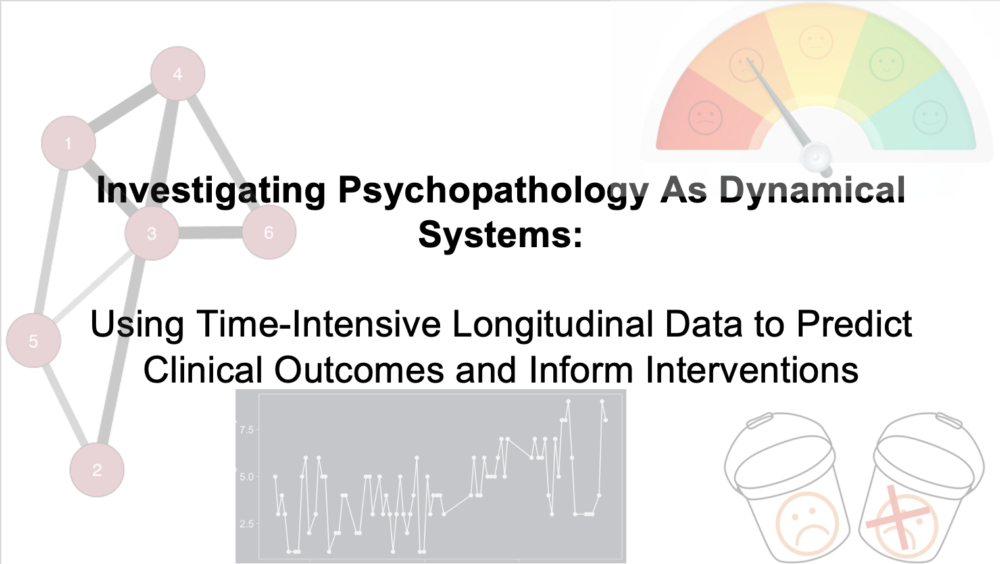
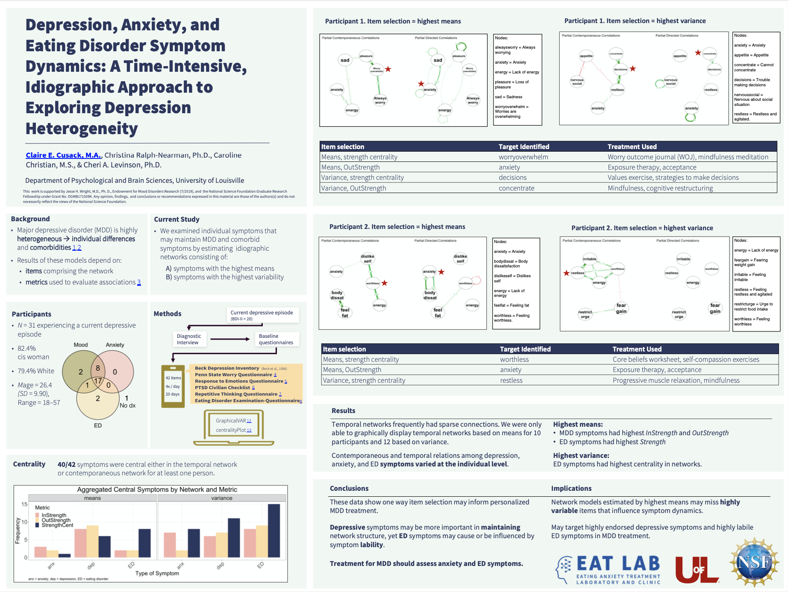
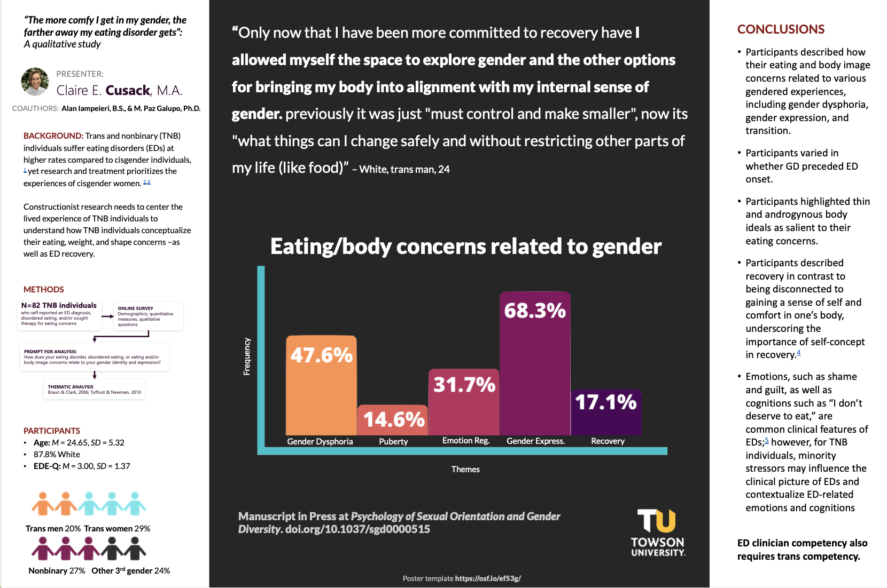
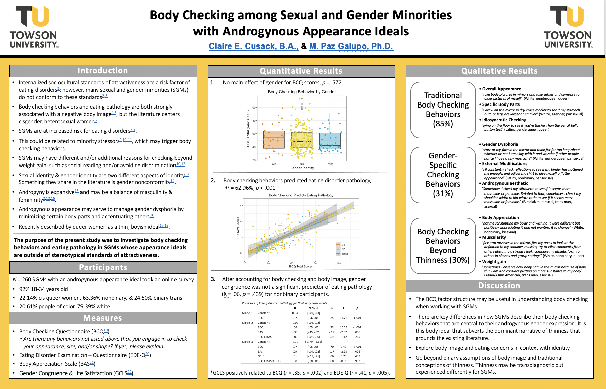

:::: {style="display: flex;"}
::: {}
My research is centered on understanding trajectories eating disorder relapse, recovery, and maintenance within individuals. We know that eating disorders look different across persons, but we don't know why or how that impacts treatment. We also know that only half of people who access evidence-based treatment will recover. Thus, my program of research aims to understand the mechanisms that influence eating disorder psychopathology by considering individual variability, time, and context. I think that an idiographic framework, coupled with methods that leverage time-intensive data in naturalistic settings are best equipped to examine how eating disorders unfold in real time in the real world. I hope that this focus will inform personalized treatment to improve clinical outcomes, and ultimately facilitate recovery. I also have a line of research that specifically focuses on ED and body image experiences of queer and trans individuals. Most of my questions can be distilled to:  

- Why do eating disorders persist?  
- At what timescale do symptoms change?    
- How do we make sense of the heterogeneity?   
- How can we use this information to improve treatment?    
:::
::: {}
  <figure>
    
    
    
  </figure>
:::
::::
# **Representative Publications**
<ol reversed>
<li> **Cusack, C. E.**, Vanzhula, I.A., Sandoval-Araujo, L., Pennesi, J-L., Kelley, S.W., & Levinson, C.A. (2024). Are central eating disorder network symptoms sensitive to item selection and sample? Implications for conceptualization of eating disorder psychopathology from a network perspective. Journal of Psychopathology and Clinical Science. https://doi.org/10.1037/abn0000865 </li>
<li> **Cusack, C. E.**, Vanzhula, I. A., & Levinson, C. A. (2022). The structure of eating disorder and somatic symptoms. *Journal of Affective Disorders*, 319, 397-406. https://doi.org/10.1016/j.jad.2022.09.106 </li>
<li> Levinson, C. A., **Cusack, C. E.**, Brown, M. L., & Smith, A. R. (2022). A network approach can improve eating disorder conceptualization and treatment. *Nature Reviews Psychology*, 1-12. https://doi.org/10.1038/s44159-022-00062-y </li>
<li> **Cusack, C. E.**, Iampieri, A. O., & Galupo, M. P. (In press). “I’m still not sure if the eating disorder is a result of gender dysphoria:” Trans and nonbinary individuals’ descriptions of their eating and body concerns in relation to their gender. *Psychology of Sexual Orientation and Gender Diversity*.</li>
<li> Galupo, M. P., **Cusack, C. E.**, & Morris, E. R. (2021). "Having a non-normative body for me is about survival”: Androgynous or non-stereotypical body ideal among trans and nonbinary individuals. *Body Image, 39*, 68-76. https://doi.org/10.1016/j.bodyim.2021.06.003 </li>
<li> **Cusack, C. E.**, Christian, C., Drake, J. E., & Levinson, C. A. (2021). A network analysis of eating disorder symptoms and co-occurring alcohol misuse among heterosexual and sexual minority college women. *Addictive Behaviors*. https://doi.org/10.1016/j.addbeh.2021.106867. Preregistration on Open Science Framework osf.io/r5tka.</li>
<li> **Cusack, C. E.**, & Galupo, M. P. (2020). Body checking and eating disorder pathology among nonbinary individuals with androgynous appearance ideals. *Eating and Weight Disorders - Studies on Anorexia, Bulimia and Obesity*. https://doi.org/10.1007/s40519-020-01040-0 </li>
<li> **Cusack, C. E.**, Morris, E. R. & Galupo, M. P. (2020). “A blank slate body:” Cis descriptions of their androgynous body ideals. *Psychology & Sexuality*. https://doi.org/10.1080/19419899.2020.1837920</li>
<li>Pulice-Farrow, L., **Cusack, C. E.**, & Galupo, M. P. (2020). Certain parts of my body don’t belong to me: Transindividuals’ descriptions of body-specific gender dysphoria. *Sexuality Research and Social Policy*, 17, 654–667. https://doi.org/10.1007/s13178-019-00423-y</li>
</ol reversed>
# **Presentations**
<body>
   
Association for Psychological Sciences Annual Conference, May 2022

   
   </body> 
   <body>
   
# **Posters**
**Treatment Selection Idea Lab 2021**    
<body>
   
Two Days of Precision Medicine in Mental Health, September, 2021

   
   </body> 
   <body>
**American Psychological Association**    
<body>
   
August 2021

   
   </body> 
**Association for Behavioral and Cognitive Therapies**  
<body>
   
November 2020

   
   </body> 
**American Psychological Association**  
<body>
   
August 2020

   
   </body> 
