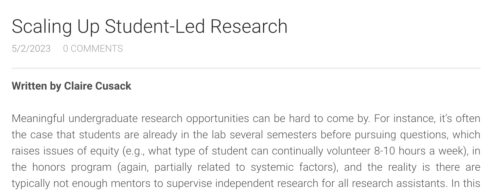
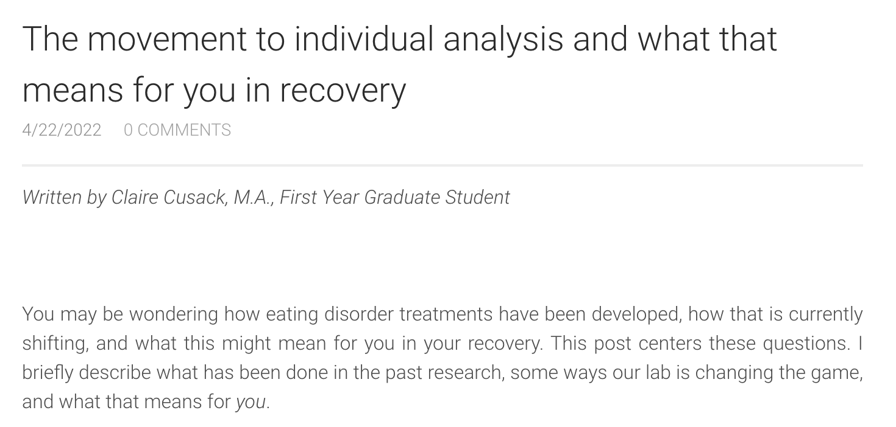
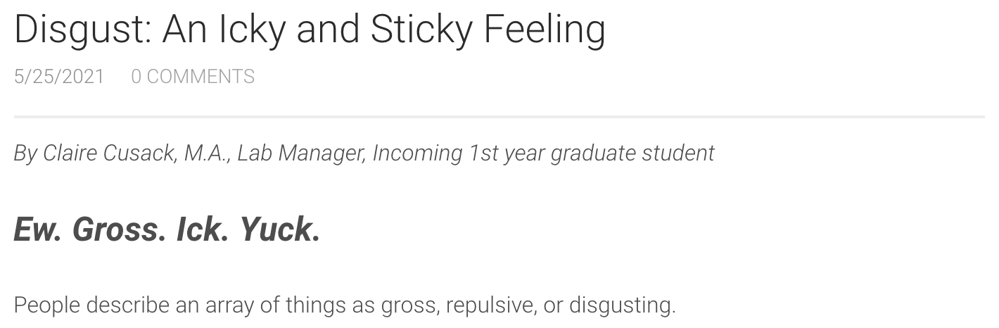
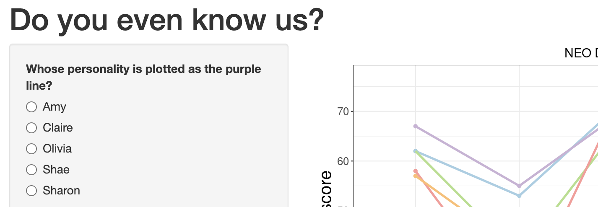
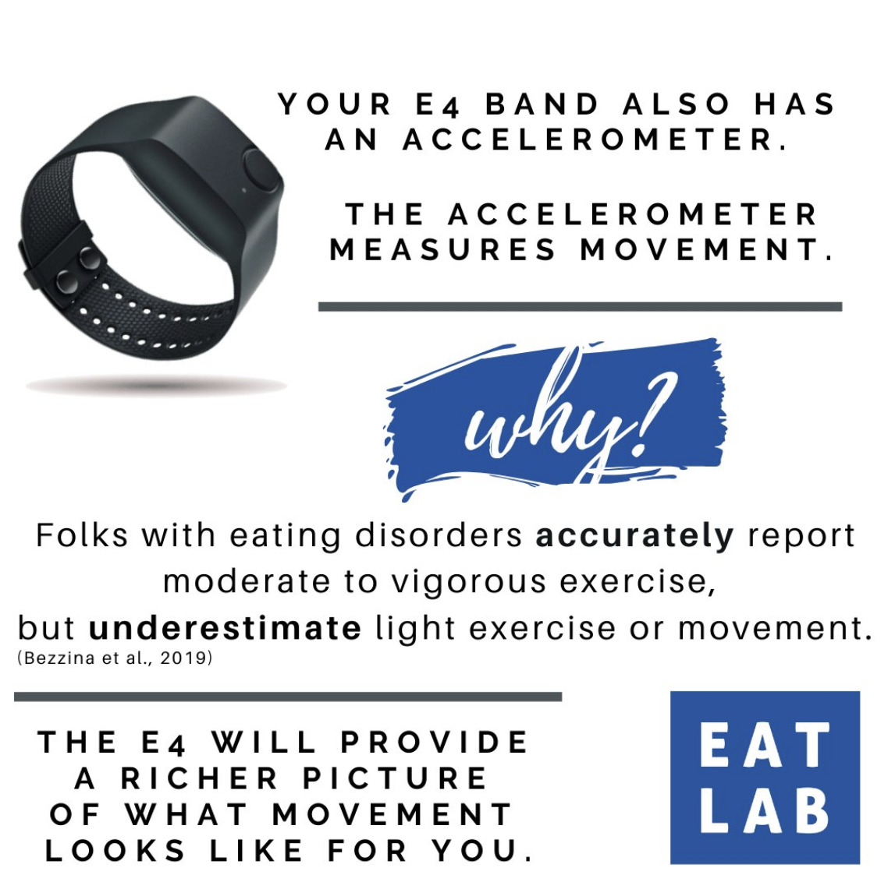
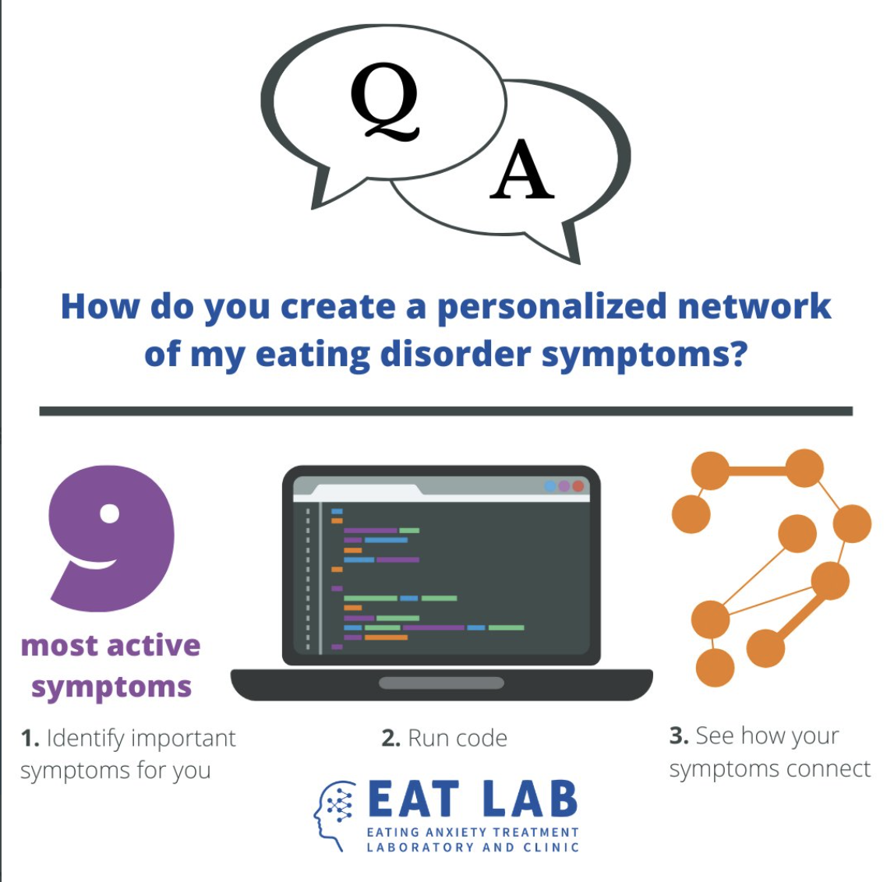

# Blog Posts
  <body>
   
Here I write about implementing CURE principles into EAT Lab Research Assistant meetings

   
   </body> 
   <body>
   
Read my post on moving from group level analyses to the individual level in eating disorder research

   
   </body> 
   <body>
   
How to manage disgust in context of your eating disorder

      
   </body> 
   <body>
   
Worry or Rumination? How are they different and what's it have to do with eating disorders

      
   </body>

# Shiny App
   <body>
   
I plotted my cohort's NEO profiles for a guessing game

      
   </body>

# Social Media
   <body>
   
EAT Lab images for Social Media

       
      
   </body>

# Video

I speak with Drs. Rachel MacIntyre, PhD, and Megan Lynch, PsyD about eating disorders among LGBTQ+ individuals

<iframe width="560" height="315" src="https://www.youtube.com/embed/sFfzg0v_P0g" title="YouTube video player" frameborder="0" allow="accelerometer; autoplay; clipboard-write; encrypted-media; gyroscope; picture-in-picture" allowfullscreen></iframe>
