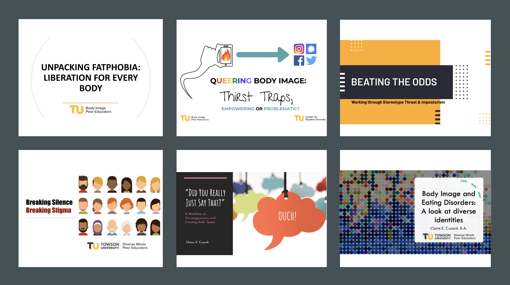

A central component of my academic identity centers service. I am passionate about initiatives that influence public policy, such as increasing access to mental health care, and creating safer spaces within academia for students with marginalized identities. As an emerging scientist, I believe it is my responsibility to make Clinical Science an inclusive environment. Many of my identities are privileged. My whiteness affords me safety within and outside of academic spaces and comes with generational wealth. I live in an able-body, received higher education, and my immediate family also has advanced degrees. I identify my gender as cis/agender femme, as gender is not salient to me, and I consider my sexual orientation queer. I do not experience gender dysphoria, and I often express my gender femme-of-center. Though this means I am often misread by others, it also means that people do not mark me as deviating from binary gender norms. 

# Mentorship
I recognize that one of the most effective ways to promote diverse scholarship is through mentoring those with less privileged positionalities than me. To this end, I have mentored undergraduate students on professional and academic development. This has included mentorship on undergraduate theses, writing letters of recommendation, and making myself available for mock interviews. I have also designed and implemented a course-based undergraduate research experience that provides research-based mentorship. Materials can be accessed [here](https://drive.google.com/drive/folders/19ZrJt9ZORLDeAjFrQ_tgsWfrVsWTAggz).

# Committees
* **Academy for Eating Disorders**, 2020 - 2023
  Membership Recruitment and Retention Committee (MRRC), Diversity, Equity, and Inclusion subcommittee
* **Kentucky State Council for Eating Disorders**, 2021 - present
  Accessibility, Affordability, and Accountability Committee

# Programming
I've created 30-45 minute interactive workshops for college students on a range of mental health topics.

